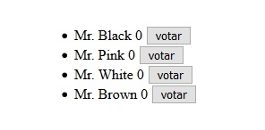
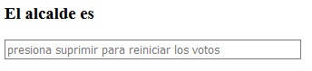

#Semana 4
---   
    
#### HTML   
Recorrido de vector candidatos, con la funcion cantidad++ al ocurrir el evento click.
   
	<li v-for = "candidato of candidatos">
        {{candidato.nombre}}  {{candidato.cantidad}} 
        <button @click = "candidato.cantidad++"> votar </button>
	</li>

#### JS
Valor inicial de los elementos de la variable ganadro y de los elementos del vector candidatos.
   
	data: {
        voto: 0,
        candidatos:[
            {nombre: 'Mr. Black', cantidad: 0},
            {nombre: 'Mr. Pink', cantidad: 0},
            {nombre: 'Mr. White', cantidad: 0},
            {nombre: 'Mr. Brown', cantidad: 0},
        ],
        ganador: ''
    },

 

***

#### HTML
    
Campo de texto, cuando ocurre el evento click muestra el candidato con mayor cantidad de votos, cuando se le da al boton suprimir e reinicia el conteo.
    
	<h3>El alcalde es {{ganador}}</h3>
    <input type = "text" placeholder = "presiona suprimir para reiniciar los votos" size = 50 @click = "calculo" @keyup.delete = "reset">

#### JS
Funcion calculo():   
Ordena los candidatos de forma decreciente y asigna a la variable ganador el nombre del candidato en la posicion 0.

Funcion reset():   
Reinicia la cantidad de votos de todos los elementos del vector candidatos
   
	methods:{
        calculo(){
            this.candidatos.sort(function(a, b){return b.cantidad - a.cantidad});
            this.ganador = this.candidatos[0].nombre;
        },
        reset(){
            for(x of this.candidatos){
                x.cantidad = 0;
            }
        }
    }

 

